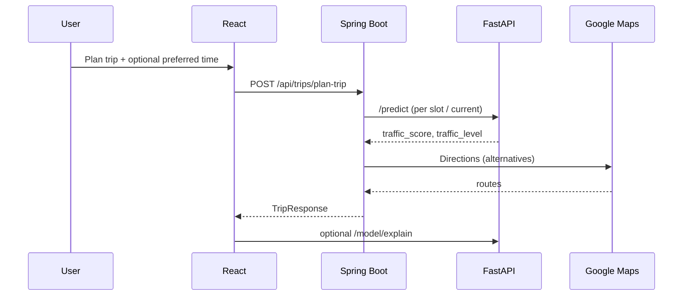
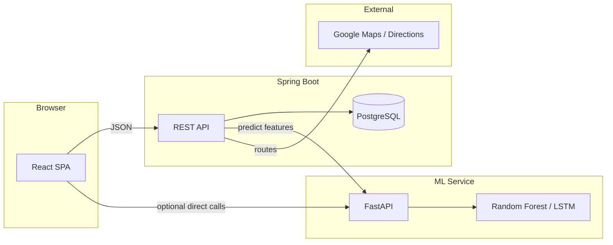

# RoadSync — Smart Highway Trip Planning & Traffic Intelligence

**Tagline:** Predict traffic, compare routes, and choose departure times using ML-backed inference, explainability, and a full-stack trip planning workflow.

**At a glance:** RoadSync is a **full-stack** system (React + Spring Boot + FastAPI + PostgreSQL) built for **highway-style trips**—especially contexts like **Indian highways**, where weekends, holidays, and time-of-day strongly affect congestion. You submit origin, destination, travel date, and optional **preferred time of day**; the backend calls a **traffic ML model**, merges **simulated live traffic**, ranks **departure-hour slots**, scores **Google Maps route alternatives**, and returns a structured response with **best departure time**, **route comparison**, **delays**, **explainability (SHAP)**, and optional **analytics dashboards**.

---

## Table of contents

1. [What RoadSync does (detailed)](#what-roadsync-does-detailed)
2. [How it works (end-to-end)](#how-it-works-end-to-end)
3. [Recent additions & changelog](#recent-additions--changelog)
4. [Project overview](#project-overview)
5. [Repository layout](#repository-layout)
6. [Architecture](#architecture)
7. [Backend (Spring Boot)](#backend-spring-boot)
8. [Frontend (React)](#frontend-react)
9. [ML service (FastAPI)](#ml-service-fastapi)
10. [Data & feature engineering](#data--feature-engineering)
11. [Core algorithms & business logic](#core-algorithms--business-logic)
12. [API summary](#api-summary)
13. [Configuration & security](#configuration--security)
14. [Installation & how to run](#installation--how-to-run)
15. [Screenshots](#screenshots)
16. [Future improvements](#future-improvements)
17. [Contributing & author](#contributing--author)

---

## What RoadSync does (detailed)

| Area | What happens |
|------|----------------|
| **Trip planning** | `POST /api/trips/plan-trip` persists a `Trip`, runs ML + heuristics, and returns `TripResponse` (traffic level/score, best departure, alternatives, routes, best route + score breakdown, leave-now vs best-time, time saved, live flag). |
| **Preferred time of day** | Optional `preferredTime` (e.g. `afternoon`) maps to **hour bands** in `PredictionService`. When set, the backend **only** optimizes within that band—**no separate “global best”** that could suggest e.g. 4:00 AM while you asked for afternoon. `TripResponse` exposes `bestDepartureTime`, `bestPreferredTime` (when a band is used), and `bestOverallTime` **only when no preference** is chosen (full-day grid). |
| **Live traffic (simulated)** | `RealTimeTrafficService` adds controlled **random variation** and **time-of-day spikes** to ML scores, merges into a **0–100** score, and sets `liveTraffic: true` in the response. |
| **Departure slots** | Default grid uses discrete hours (e.g. early morning through evening). Ranking: ML score → live merge → **convenience penalty** for awkward hours → **`finalScore`**; minimum wins. |
| **Leave vs best time** | `DelayCalculator` maps scores to **delay minutes** so “leave now” and “best departure” are comparable; **time saved** is derived from delay difference. |
| **Routes** | Google Directions with **alternatives**; per route: ML traffic, distance, **estimated toll**; **weighted normalization** (`RouteOptimizationService`) picks **best route** and returns **`scoreBreakdown`**. |
| **Explainability** | FastAPI **`POST /model/explain`** (SHAP) for top contributing features; trip UI can show “why” traffic is high. |
| **Analytics** | Spring Boot **`/api/analytics/*`** feeds a React **Dashboard** (Recharts): traffic vs time, holiday impact, route congestion, day traffic, distribution, time predictions; ML **`/model/evaluation`** for model metrics. |
| **UI** | Coffee-themed **Plan Trip** page: form, results, **LIVE** badge, departure recommendations respecting **preferred band**, route comparison, stacked bar from `scoreBreakdown`, explain panel, map; **Home** and **Navbar**; **Dashboard** page. |

---

## How it works (end-to-end)

1. **User** opens the React app and fills **source**, **destination**, **travel date**, optional **preferred time** (e.g. afternoon), and selects **user** / **vehicle** IDs (seeded in the database).
2. **Frontend** sends `POST /api/trips/plan-trip` with a `TripRequest` (`TripController` → `TripService`).
3. **TripService** saves the trip, then:
   - Fetches **leave-now** traffic via the **ML client** (`MLService` → FastAPI `/predict`) and merges with **`RealTimeTrafficService`** for the **current** hour.
   - If **no** `preferredTime`: runs **`PredictionService.getBestDepartureTime`** once over the **full** slot grid → `bestDepartureTime` and `bestOverallTime` align with that run.
   - If **`preferredTime` is set**: skips the global-only run; runs **`getBestDepartureTime`** with **start/end hours** derived from the band → `bestDepartureTime` and `bestPreferredTime` reflect **only** that band (so the UI does not surface a misleading “best at 4 AM” when you chose afternoon).
   - Builds **alternatives** from the same prediction list; computes **delays** and **time saved**.
   - Calls **Google Directions** (`RouteService`) for multiple routes, scores each route, and runs **`RouteOptimizationService`** to pick **`bestRoute`** and **`scoreBreakdown`**.
4. **Response** is returned as `TripResponse`; the **Plan Trip** page renders departure cards, recommendations, and route UI; optional calls to **`/model/explain`** for SHAP factors.
5. **Dashboard** independently calls **`/api/analytics/*`** and optionally **`/model/evaluation`** on the ML service for charts and model health.



---

## Recent additions & changelog

This section documents **major features and behavior** added in recent development (useful for reviewers and contributors).

| Addition | Description |
|----------|-------------|
| **`TripRequest.preferredTime`** | Optional string (e.g. `midnight`, `early morning`, `morning`, `afternoon`, `evening`, `night`) with optional `preferredStartHour` / `preferredEndHour` for custom windows. |
| **`TripResponse` departure fields** | `bestDepartureTime` — primary recommendation from the **active** prediction run (full grid or preferred band). `bestOverallTime` — **only** when **no** preferred time is set (full-day “global best”). `bestPreferredTime` — set when a band is used; mirrors the band-restricted best. |
| **Preferred-band-only optimization** | When `preferredTime` is set, the service **does not** compute a separate global best across all hours, avoiding confusing suggestions (e.g. 4 AM while “afternoon” is selected). |
| **`PredictionService`** | Hour grids, band mapping, `finalScore` with convenience penalties, integration with **real-time** merge. |
| **`RealTimeTrafficService`** | Simulated live adjustments and `mergeWithPrediction`. |
| **`RouteOptimizationService`** | Normalized multi-criteria scoring (traffic / distance / toll weights), `bestRoute`, `RouteScoreBreakdown`. |
| **`RouteOption` / route scoring** | Richer route DTOs with traffic, distance, toll estimates for comparison. |
| **Analytics stack** | `AnalyticsController` + `AnalyticsService` + DTOs (`TrafficTimePoint`, `HolidayImpactPoint`, etc.) for dashboard series. |
| **Frontend** | `Dashboard.jsx`, analytics API helpers in `api.js`, **PlanTrip** UX for departure sections (show **Best overall** only when `bestOverallTime` is present; **Best in your selected range** when applicable), `MapView`, `Home`, styling. |
| **ML service** | Routes for **`/model/evaluation`**, **`/model/explain`**, supporting modules (`evaluate.py`, `explain.py`, etc.). |

---

## Project overview

RoadSync is a **full-stack** application for **highway-style trip planning** with **traffic prediction**, **departure-time recommendations**, **leave-now vs best-time comparison**, **multi-route analysis**, and **analytics**. It targets contexts such as **Indian highway travel**, where weekends, holidays, and peak hours strongly affect congestion.

The system answers questions such as:

- Should I leave now or at a calmer time?
- If I only want to drive in the **afternoon**, what is the best hour **within that window**?
- Which route balances traffic, distance, and toll?
- Why is traffic predicted as high for this trip?
- How do models perform on the training data?

---

## Repository layout

```
Roadsync/
├── backend/          # Spring Boot — REST API, JPA, orchestration, Google client
├── frontend/         # React (Vite) — trip planner, map, dashboard
├── ml-service/       # FastAPI — predict, explain, model evaluation
├── data/             # traffic.csv, holidays.csv (training / analytics)
├── docs/             # additional documentation (e.g. overview, API key notes)
├── .env              # root env template (keys not committed — use .gitignore)
└── README.md         # this file
```

---

## Architecture

High-level data flow:



- **React** talks to **Spring Boot** for trip planning, analytics, and persistence.
- **Spring Boot** calls **FastAPI** for traffic **inference** (and may be extended to proxy explain/evaluate if desired).
- **Google Maps** supplies **directions** and route alternatives when an API key is configured.
- The **ML service** can also be called **directly from the browser** for explain/evaluate in development (see `frontend/src/services/api.js`).

---

## Backend (Spring Boot)

**Base package:** `com.roadsync`

### Layers

| Layer | Role |
|-------|------|
| **Controller** | HTTP mapping, validation (`TripController`, `AnalyticsController`, etc.). |
| **Service** | Business logic: trips, predictions, routes, stops, ML HTTP client, **real-time adjustment**, **route optimization**. |
| **Repository** | Spring Data JPA for `User`, `Vehicle`, `Trip`. |
| **DTO** | Request/response records (`TripRequest`, `TripResponse`, `RouteOption`, `RouteScoreDetail`, `RouteScoreBreakdown`, …). |
| **Util** | `DelayCalculator` — maps **traffic score** to **delay minutes** consistently. |

### Important services

- **`TripService`** — Orchestrates: save trip → **current traffic** (ML + live merge) → **best departure** (`PredictionService`; **full grid vs preferred band** as described above) → **delays** and **time saved** → **Google routes** → **`RouteOptimizationService`** → builds **`TripResponse`** (including **`bestRoute`**, **`scoreBreakdown`**, **`bestOverallTime` / `bestPreferredTime`**, **`liveTraffic`**).
- **`PredictionService`** — Iterates departure **slots** (full grid or **band-filtered**), calls ML, applies **real-time merge** per slot, adds **convenience penalty**, ranks by **`finalScore`**, returns best time + **`TimePrediction` list**.
- **`RealTimeTrafficService`** — Simulates **live** conditions: random adjustment plus **peak / off-peak** spikes; **`mergeWithPrediction(predicted, hour)`** clamps **0–100**.
- **`RouteService`** — Calls **Directions API** with `alternatives=true`, parses **summary**, **distance**, **duration**; builds **`MLRequest`** per route (route-aware features); applies **live merge** to route traffic; **toll** estimate from distance (index-style INR-like value).
- **`RouteOptimizationService`** — For all returned routes: **min–max normalize** traffic, distance, toll to **[0, 1]**; **`finalScore = 0.5·nTraffic + 0.3·nDistance + 0.2·nToll`**; selects **lowest** as **`bestRoute`**; returns **`scoreBreakdown`** with weights and per-route details.
- **`MLService`** — REST client to FastAPI **`/predict`** with graceful **fallback** if ML is down.
- **`StopService`** — Stop suggestions for the response; UI may hide markers (see frontend).
- **Analytics** — `AnalyticsService` aggregates or loads series for **`/api/analytics/*`** consumed by the dashboard.

### Key DTO: `TripResponse` (conceptual)

Includes among others: **message**, **tripId**, **trafficLevel**, **trafficScore**, **bestDepartureTime**, **bestOverallTime** (full grid only, when no preferred band), **bestPreferredTime** (when a preferred band is used), **alternatives**, **routes** (`RouteOption` with **tollCost**), **`bestRoute`** (`RouteScoreDetail`), **`scoreBreakdown`**, **stops**, **leaveNow**, **bestTime**, **timeSaved**, **`liveTraffic`**.

---

## Frontend (React)

**Stack:** Vite, React, React Router, Tailwind CSS, Axios, Recharts, `@react-google-maps/api`.

### Pages

| Page | Purpose |
|------|---------|
| **Home** | Landing / entry. |
| **Plan trip** | Form → **`POST /api/trips/plan-trip`**; shows prediction, **LIVE** banner when `liveTraffic` is true, **leave vs best**, **Departure times** (overall vs **in your selected range** when applicable), **Departure Recommendations**, **route comparison** (Traffic / Distance / Toll / Duration), **“Best Route Selected based on multiple factors”**, stacked bar from **`scoreBreakdown`**, **SHAP explain** section (“Why traffic is high?”), map with multi-route selection. |
| **Dashboard** | Analytics charts + **model evaluation** (when ML evaluation API is reachable). |

### Behaviors

- **Live indicator:** “Live Traffic Data Active” + **LIVE** badge; optional **UI-only** small score jitter on an interval so the display feels live without spamming new trips.
- **Explainability UI:** Calls **`POST /model/explain`** (FastAPI) with derived features and shows top factors + bar chart.
- **Route cards:** Labels **Route A, B, …**; highlights backend **`bestRoute`**; formats toll as **₹**.
- **Preferred time:** Copy clarifies that listed times respect the chosen band when a preference is set.

---

## ML service (FastAPI)

**Location:** `ml-service/app/`

### Endpoints (typical)

| Method | Path | Description |
|--------|------|-------------|
| GET | `/` | Health string |
| POST | `/predict` | Features in → **traffic_level**, **traffic_score** |
| GET | `/model/evaluation` | RF accuracy, confusion matrix, LSTM RMSE, etc. |
| POST | `/model/explain` | **SHAP** top features for Random Forest pipeline |

### Models

- **Random Forest** — Trained on `data/traffic.csv`; sklearn **pipeline** (numeric + categorical preprocessing); persisted as **`traffic_model.pkl`**.
- **LSTM** — Sequence model on scaled features; **`lstm_model.h5`**, **`scaler.pkl`**; configurable vs RF in **`app/config/settings.py`**.
- **Training scripts** — e.g. `train_model.py`, `train_lstm.py`; **compare** script for metrics.

### Explainability

- **`shap.TreeExplainer`** on the forest inside the sklearn pipeline; returns **`predicted_class`** and **`top_factors`** `{ feature, impact }`.

---

## Data & feature engineering

- **`data/traffic.csv`** — Simulated highway traffic rows: time features, route codes, **traffic_level**, **traffic_score**, etc.
- **`data/holidays.csv`** — Indian holiday windows and importance (for analytics / future features).

Features used for RF-style prediction typically include: **hour**, **day_of_week**, **month**, **is_weekend**, **is_holiday**, **days_to_holiday**, **route**.

---

## Core algorithms & business logic

### 1) Real-time merge (simulated)

\[
\text{merged} = \text{clip}\bigl(\text{ml\_score} + \text{noise} + \text{hour\_spike},\, 0,\, 100\bigr)
\]

Used for **current traffic** and for **slot / route** predictions so recommendations react to time-of-day.

### 2) Departure ranking

For each candidate hour: **ML score** → **live merge** → add **convenience penalty** (e.g. very early / late hours) → **`finalScore`**; pick **minimum** for best departure. If a **preferred band** is active, candidate hours are **restricted** to that band before ranking.

### 3) Delay mapping

**`DelayCalculator`** maps **traffic score** ranges to **delay minutes** (single place for consistency). Trip response may also map **high/medium/low** style delays where applicable.

### 4) Route optimization

For each route \(i\):

- Raw: **trafficScore**, **distanceKm**, **tollCost** (estimate).
- Normalize each dimension across routes: \(n \in [0,1]\) (equal values → **0.5**).
- **Composite:**  
  \(\text{finalScore}_i = 0.5\,n_{\text{traffic}} + 0.3\,n_{\text{distance}} + 0.2\,n_{\text{toll}}\).
- **Best route** = **argmin** \(\text{finalScore}_i\) (lower is better).

Unit tests in **`RouteOptimizationServiceTest`** validate normalization and weighted scores.

---

## API summary

### Spring Boot (default `http://localhost:8080`)

- **`GET /api/test`** — Sanity check (if enabled).
- **`POST /api/trips/plan-trip`** — Main trip plan; body: `TripRequest` (user, vehicle, source, destination, travel date, optional `preferredStartHour`, `preferredEndHour`, `preferredTime`).
- **`GET /api/analytics/traffic-time`**, **`/holiday-impact`**, **`/route-congestion`**, **`/day-traffic`**, **`/traffic-distribution`**, **`/time-predictions`** — Dashboard series.

### FastAPI ML (default `http://127.0.0.1:8000`)

- **`POST /predict`**
- **`GET /model/evaluation`**
- **`POST /model/explain`**

---

## Configuration & security

- **Environment variables** (never commit real keys): e.g. **`GOOGLE_MAPS_API_KEY`**, database URL/user/password for PostgreSQL.
- Root **`/.env`** and per-app **`.env`** patterns; **`docs/`** may list key names.
- **`.gitignore`** excludes **`.env`** and build artifacts.

Without a valid **Google Maps** key, **route lists may be empty**; trip planning still works for ML + delays + departure logic.

---

## Installation & how to run

### Prerequisites

- Java **17+**, Maven, Node.js, Python **3**, PostgreSQL (for full persistence).

### ML service

```bash
cd ml-service
pip install -r requirements.txt
uvicorn app.main:app --reload --port 8000
```

Train models if artifacts are missing (see `app/model/` scripts).

### Backend

```bash
cd backend
mvn clean install
mvn spring-boot:run
```

Ensure **`application.properties`** (or env) points to a running PostgreSQL instance, or use your project’s documented dev workaround if any.

### Frontend

```bash
cd frontend
npm install
npm run dev
```

Vite default: **`http://localhost:5173`**. CORS should allow the frontend origin from the backend config.

### Suggested startup order

1. PostgreSQL (if used)  
2. ML service (`:8000`)  
3. Spring Boot (`:8080`)  
4. Frontend (`:5173`)

---

## Screenshots

Add screenshots here for:

- Trip planning + results + LIVE badge  
- Route comparison + stacked bar  
- Explainability panel  
- Dashboard + model evaluation  

---

## Future improvements

- **Live traffic feeds** from providers (replace or augment simulation).  
- **EV charging** and richer **toll APIs** (exact plaza costs).  
- **Proxy** explain/evaluate through Spring Boot for a single origin and auth.  
- **Mobile app** and **push notifications** for departure reminders.  
- **Re-enable** map stop markers with **Places API** when ready.

---

## Contributing

Issues and pull requests are welcome. Please keep changes focused, match existing style, and update this README when you change user-visible behavior or APIs.

---

## Author

Developed as a portfolio-grade **full-stack + ML** project: **RoadSync**.

---

## Why this README is structured this way

- **Overview + “what it does”** gives recruiters and collaborators immediate scope.  
- **End-to-end flow + changelog** document **design decisions** (including preferred-time behavior).  
- **Architecture + algorithms** show **system design**, not only features.  
- **API + config + run order** make the repo **reproducible**.
